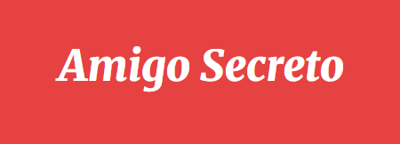

#Entrega do Desafio Alura

<h1 align="center"> Sorteio Amigo Secreto </h1>

<h6 align="center"> Projeto solicitado pela Alura, modificado e editado por mim. </h6>
<h3 align="center"> Desafio com base nas aulas feito em JavaScript, com edições feitas no projeto base HTML fornecido pela Alura. </h3>

<h2> Descrição </h2>
<h4 align="center"> Projeto em desenvolvimento, concluido para o challenge mas com ampla capacidade de melhora. </h4>
<h4 align="center">  O Sorteio Amigo secreto tem como objetivo receber uma lista de pessoas com mais de 2 pessoas</h4>
<h4 align="center"> na primeira página (index.html) e na segunda página  (indexdois.html) perguntar quem é a pessoa</h4>
<h4 align="center"> e mostrar a ela quem ela tirou como amigo secreto. </h4>

<h2> Funcionalidades </h2>
<ul> Foram adicionadas funções para: </ul>
<ul align="center"> mostrar o sorteio para pessoa correta. </ul>
<ul align="center"> Adicionar nomes a uma lista </ul>
<ul align="center"> Atualizar a lista sempre que voltar a primeira página. </ul>
 
<ul> Foi usado para sortear as pessoas: </ul>
<ul align="center">   if , else e while </ul>
<ul align="center"> arrays </ul>

<h2>Desenvolvedor</h2>

<h6 align="center">Projeto desenvolvido por mim com a base fornecida pela Alura.</h6>
<h6 align="center">Foram usados videos e aulas dos cursos da Alura.</h6>
<h6 align="center">Desenvolvido por Lucas Silva.</h6>

